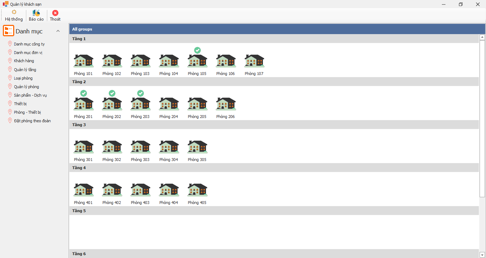
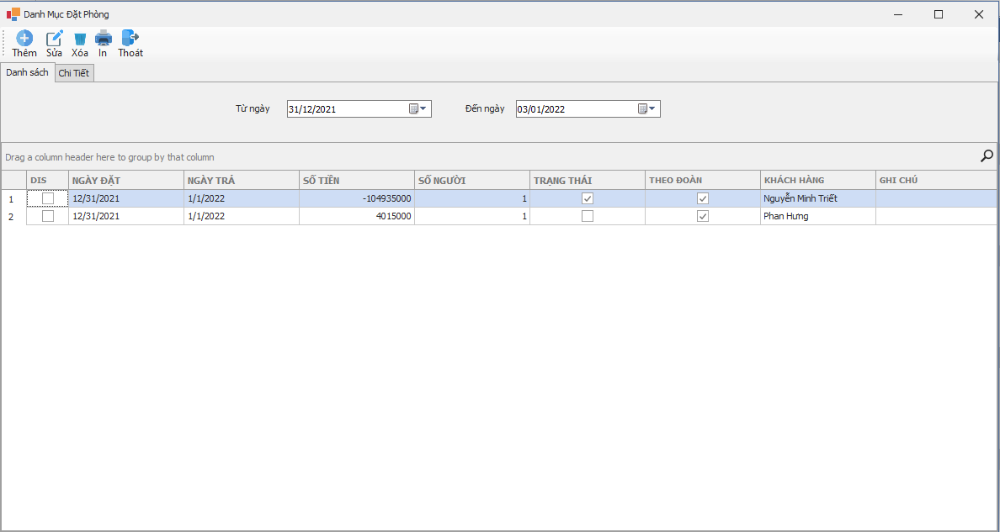
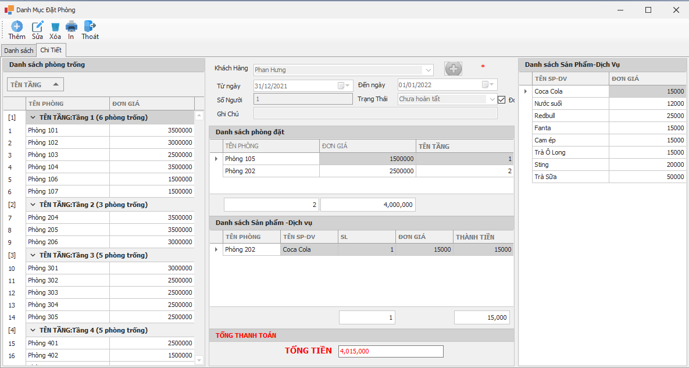
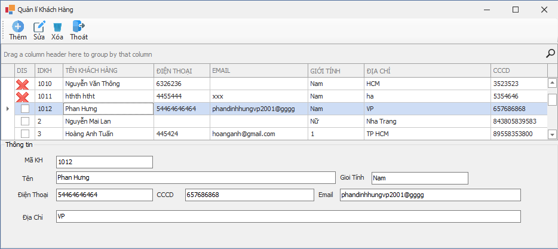
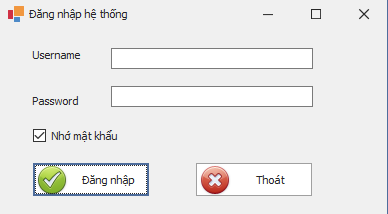
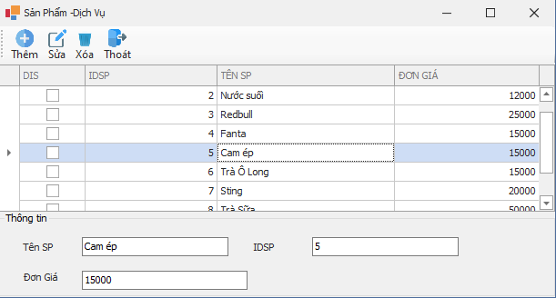

# QuanLyKhachSan C# use Entitry Frameworks from VS IDE 2019 vs Dev Express v19.x

## Preview
&nbsp;
&nbsp;
&nbsp;
&nbsp;
&nbsp;
&nbsp;
 

* Copyright @hungphan2001
* Use Crystal Report for making report
